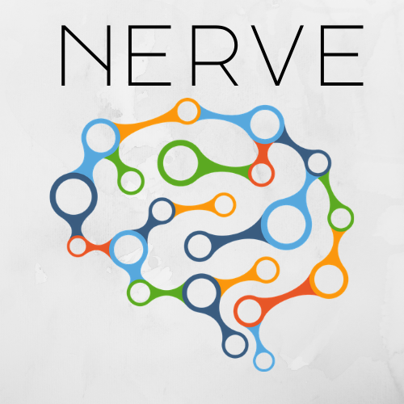

# nerve

<samp>
A python library for doing pre-processing on image data for training computer vision models

Features to implemented

- breaking video into images (frames)
- Image data generation
  - Increasing image training data by twisting it into different perspective and angles
- Simplifying process image data
  - Auotomated noise removal
  - Resizing all images training data into one resolution
  - Easy loading of image data from folders ready for training

Stay tuned !!!
</samp>